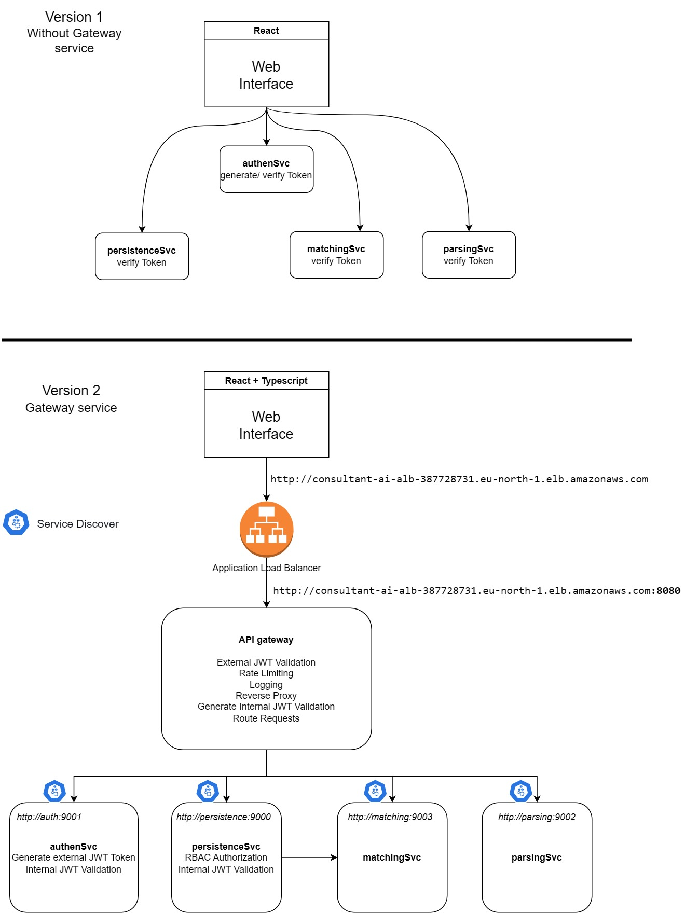

# Microservices architecture

- Gateway service
    - HTTP port 8080
- Persistence service
    - HTTP port 9000
- Authentication service
    - HTTP port 9001
- Matching service
    - HTTP port 9003
- Parsing service
    - HTTP port 9002

 

# Request authorization

Protected requests enter through the gateway on port 8080. The gateway validates
the external access token (`aud=api`), rate-limits by JWT subject, and replaces
the caller token with a 30-second internal identity token (`iss=gateway`,
`aud=persistence`). Persistence loads the caller's current role and applies RBAC.

For `PUT /profile/:id`, persistence maps the operation to `cv:update`. An `any`
grant queries by CV ID; an `own` grant queries by both CV ID and `ownerId`.
Missing grants return 403. A missing CV and an ownership mismatch both return the
same generic 404 response.

Required environment variables:

```sh
export EXTERNAL_JWT_SECRET='replace-with-auth-service-secret'
export INTERNAL_IDENTITY_SECRET='separate-long-random-secret'
export MONGO_URI='mongodb://...'
```

# APIs

## 1. Authentication service
```
router.POST("/signup", authGetFirstToken(), signupHandler(authentication))
router.POST("/login", authGetFirstToken(), loginHandler(authentication))
router.POST("/forgot-password", forgotPasswordHandler(authentication))
router.POST("/new-password", resetPasswordHandler(authentication))
```
## 2. Persistence service
```
router.GET("/listprofiles", persistence)   // GET    /listprofiles -> GET    /listprofiles
router.POST("/profile", persistence)       // POST   /profile      -> POST   /profile
router.PUT("/profile/:id", persistence)    // PUT    /profile/:id  -> PUT    /profile/:id
router.DELETE("/profile/:id", persistence) // DELETE /profile/:id  -> DELETE /profile/:id
router.GET("/listjobs", persistence)       // GET    /listjobs     -> GET    /listjobs
router.POST("/job", persistence)           // POST   /job          -> POST   /job
router.PUT("/job/:id", persistence)        // PUT    /job/:id      -> PUT    /job/:id
router.DELETE("/job/:id", persistence)     // DELETE /job/:id      -> DELETE /job/:id
```
## 3. Matching service
```
router.POST("/matching/:consultant_id", matching)
router.POST("/embeddingmodel/consultant/:consultant_id", matching)
router.POST("/embeddingmodel/job/:job_id", matching)
```
## 4. Parsing servcie
```
router.GET("/cv/:taskId/result", parsingSvc)
router.POST("/upload/cv", parsingSvc)
```

# Run command
```
go run gatewaySvc/main.go
go run persistenceSvc/main.go
go run authenSvc/main.go

matchingSvc: python main.py
parsingSvc: python -m uvicorn main:app --reload --host 0.0.0.0 --port 9002
```
