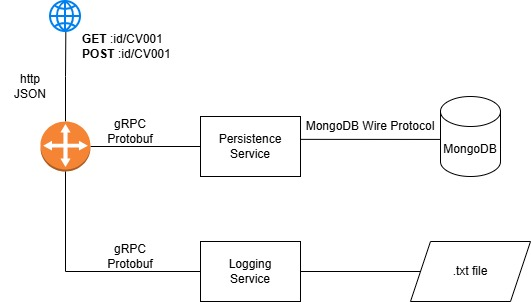

# Micro-service architecture

- Gateway service
    - HTTP port 8080
    - gRPC clients connect to Persistence service (9000) and Logging Service (6514)
- Persistence service
    - gRPC port 9000
- Logging service
    - gRPC port 6514

 

# Request authorization

Protected requests enter through the gateway on port 8080. The gateway validates
the external access token (`aud=api`), rate-limits by JWT subject, and replaces
the caller token with a 30-second internal identity token (`iss=gateway`,
`aud=persistence`). Persistence loads the caller's current role and applies RBAC.

For `PUT /profile/:id`, persistence maps the operation to `cv:update`. An `any`
grant queries by CV ID; an `own` grant queries by both CV ID and `ownerId`.
Missing grants return 403. A missing CV and an ownership mismatch both return the
same generic 404 response.

Required environment variables:

```sh
export EXTERNAL_JWT_SECRET='replace-with-auth-service-secret'
export INTERNAL_IDENTITY_SECRET='separate-long-random-secret'
export MONGO_URI='mongodb://...'
docker compose up --build
```

# APIs

1. List all profiles
2. Get a profile
3. Add a profile

# Run command
```
go run gatewaySvc/main.go
go run persistenceSvc/main.go
go run loggingSvc/main.go
```
